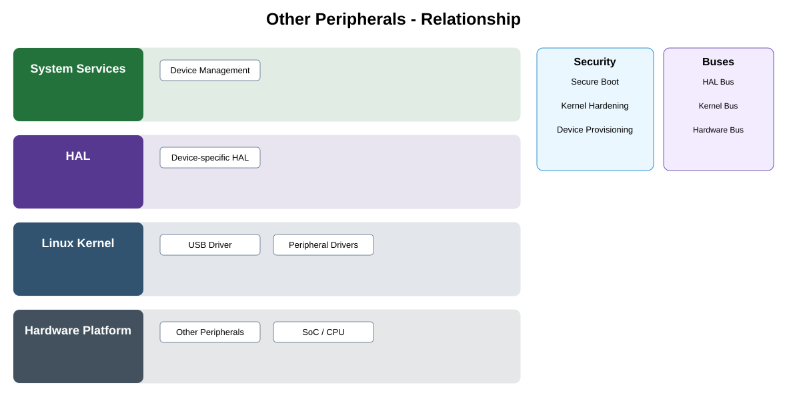

# Qualified Peripheral Extensions Detailed Design — Platform Baseline v2

## Status
Revised against PR #77.

## Deployment placement
**Optional camera hardware extensions selected by Product Profile**

## Purpose and ownership
Keep this as an extension/qualification category rather than an unrestricted generic peripheral API.

## Portable contract
Per-peripheral qualification record declaring capability, adapter owner, lifecycle, resource/security constraints, interfaces, and product applicability.

## Relationship overview

## Review-driven decisions
- Every actual peripheral is named and qualified separately.
- Register/bus details remain below adapter/driver boundary.
- Resource and security limits are explicit.
- Lifecycle and fault behavior are declared.
- Product Profile states applicability.

## Product / Security Profile inputs
- placement and provider selection;
- compatible contract/policy version;
- offline and revocation behavior;
- mandatory/optional capability and trust requirements.

## Security model
Security outcomes remain product obligations even when providers are replaceable. Enforcement occurs at the deployment performing the protected action.

## Open decisions
- concrete identity/policy/provider technologies;
- profile-specific TTL, propagation, and qualification limits.

## Design acceptance criteria
1. Unknown/unqualified peripherals do not become implicit product dependencies.
2. Each peripheral has a named adapter owner.
3. Supplier bus/register details are absent from shared middleware.
4. Removing an optional peripheral leaves common product behavior valid.

## Changelog
- 2026-10-04: Reworked for Platform Architecture Baseline v2 and review feedback.
