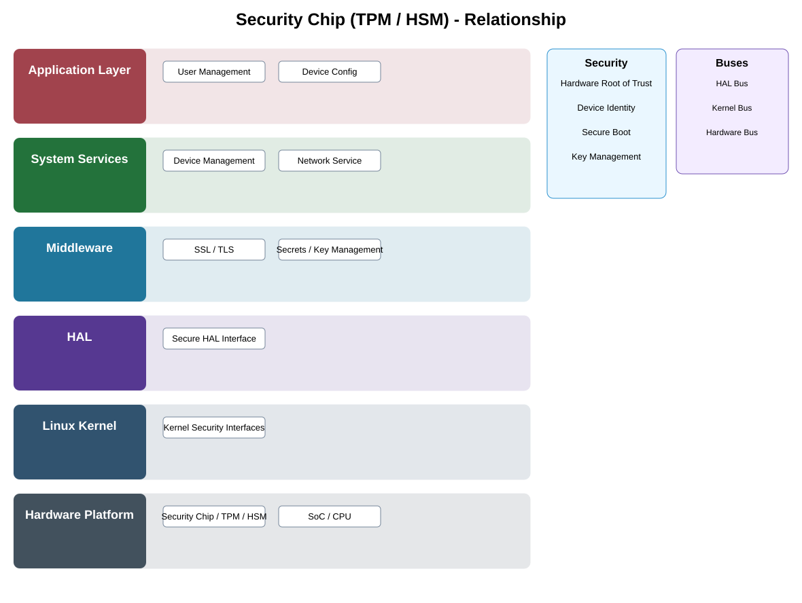

# Security Chip (TPM / HSM) Detailed Design

## Component
`security_chip_tpm_hsm`

## Purpose
Provides hardware-backed protection for device identity, cryptographic keys, measurements, and trusted security operations.

## Relationship overview

## Relevant system path

### Application Layer
- User Management
- Device Config
### System Services
- Device Management
- Network Service
### Middleware
- SSL / TLS
- Secrets / Key Management
### HAL
- Secure HAL Interface
### Linux Kernel
- Kernel Security Interfaces
### Hardware Platform
- Security Chip / TPM / HSM
- SoC / CPU

## Security context
- Hardware Root of Trust
- Device Identity
- Secure Boot
- Key Management

## Communication boundaries
- HAL Bus
- Kernel Bus
- Hardware Bus

## Dependency rules
- Hardware shall be accessed only through approved driver, HAL, and service ownership.
- Platform-specific behavior shall remain below the appropriate abstraction boundary.
- Upper layers shall consume declared capabilities rather than raw device details.

## Failure behavior
- security chip unavailable
- key operation failure
- measurement or attestation failure

## Changelog
- 2026-10-04: Added detailed relationship design.
