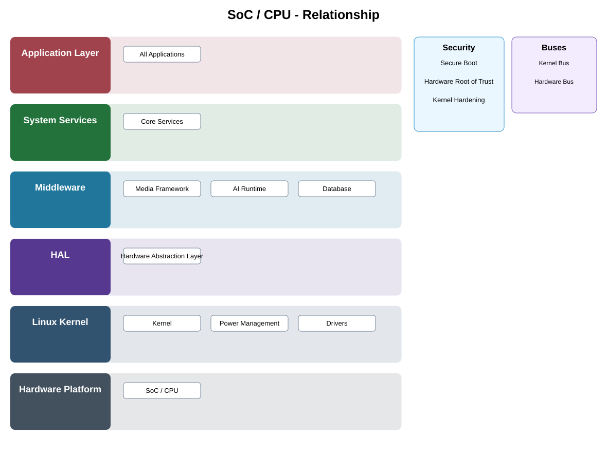

# SoC / CPU Detailed Design

## Component
`soc_cpu`

## Purpose
Provides the primary compute platform executing boot software, operating system, services, middleware, and application workloads.

## Relationship overview

## Relevant system path

### Application Layer
- All Applications
### System Services
- Core Services
### Middleware
- Media Framework
- AI Runtime
- Database
### HAL
- Hardware Abstraction Layer
### Linux Kernel
- Kernel
- Power Management
- Drivers
### Hardware Platform
- SoC / CPU

## Security context
- Secure Boot
- Hardware Root of Trust
- Kernel Hardening

## Communication boundaries
- Kernel Bus
- Hardware Bus

## Dependency rules
- Hardware is consumed only through approved kernel/HAL/service abstractions.
- Platform-specific behavior shall not leak into upper-layer application APIs.
- Security and lifecycle controls remain active across reset and power transitions.

## Failure behavior
- boot failure
- thermal throttling
- fatal platform error

## Changelog
- 2026-10-03: Added detailed relationship design.
