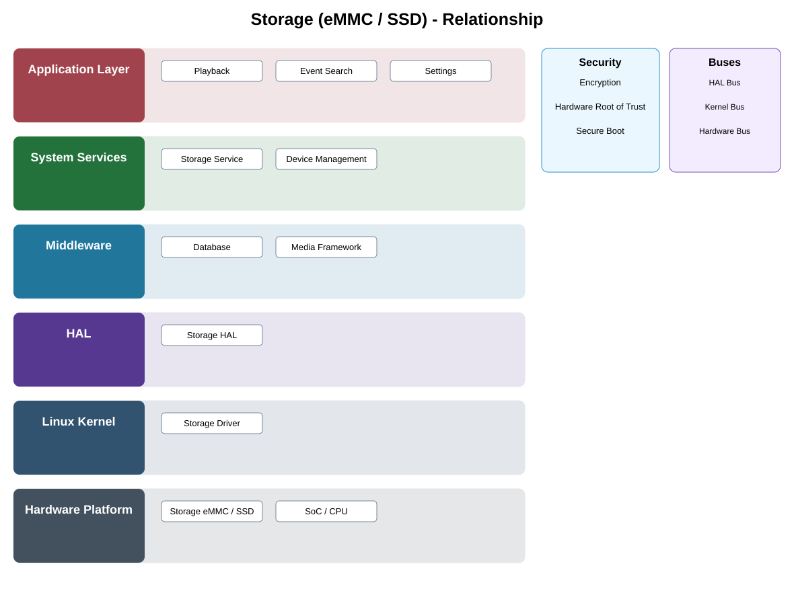

# Storage (eMMC / SSD) Detailed Design

## Component
`storage_emmc_ssd`

## Purpose
Provides non-volatile storage for software, configuration, metadata, and locally retained media.

## Relationship overview

## Relevant system path

### Application Layer
- Playback
- Event Search
- Settings
### System Services
- Storage Service
- Device Management
### Middleware
- Database
- Media Framework
### HAL
- Storage HAL
### Linux Kernel
- Storage Driver
### Hardware Platform
- Storage eMMC / SSD
- SoC / CPU

## Security context
- Encryption
- Hardware Root of Trust
- Secure Boot

## Communication boundaries
- HAL Bus
- Kernel Bus
- Hardware Bus

## Dependency rules
- Hardware is consumed only through approved kernel/HAL/service abstractions.
- Platform-specific behavior shall not leak into upper-layer application APIs.
- Security and lifecycle controls remain active across reset and power transitions.

## Failure behavior
- device wear or failure
- capacity exhausted
- I/O error

## Changelog
- 2026-10-03: Added detailed relationship design.
