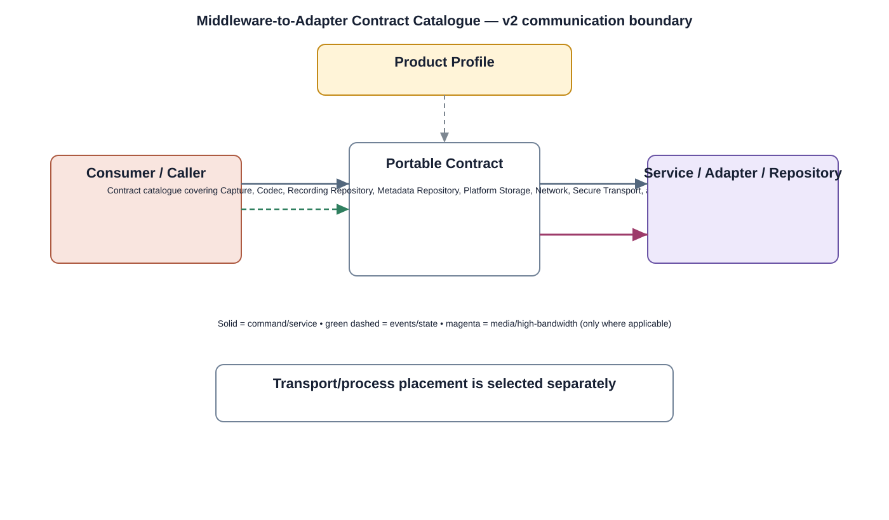

# Middleware-to-Adapter Contract Catalogue Detailed Design — Platform Baseline v2

## Status
Revised against PR #77.

## Deployment placement
**Camera/Gateway/Backend middleware as applicable; no mandatory separately deployed bus**

## Purpose and ownership
Re-scope the former Middleware Bus as a catalogue of real product-owned middleware-to-adapter contracts.

## Portable boundary
Contract catalogue covering Capture, Codec, Recording Repository, Metadata Repository, Platform Storage, Network, Secure Transport, and Inference adapter boundaries.

## Relationship overview

## Review-driven decisions
- No generic middleware bus implementation is mandatory.
- Each real interface has an owner and version rule.
- Process isolation is used only where justified by security/reliability.
- Database/filesystem/socket operations are not forced through unrelated hardware abstractions.
- Adapter replacement preserves upper product behavior.

## Product Profile inputs
- deployment/process placement;
- transport/channel/provider selection;
- compatible contract versions;
- queue/timeout/performance/security policy.

## Communication rule
Transport/process choice is independent of product semantics. Different delivery classes are not forced through one generic bus.

## Open decisions
- exact local/remote transport selections;
- numerical queue, timeout, backpressure, and compatibility limits.

## Design acceptance criteria
1. Each middleware dependency maps to a named contract rather than 'the bus'.
2. Ordinary database/filesystem/network operations use appropriate platform abstractions.
3. Process boundary choices are documented separately from contract semantics.
4. Provider replacement can be qualified per adapter contract.

## Changelog
- 2026-10-04: Re-scoped from generic bus to explicit contract/data-plane model for Platform Architecture Baseline v2.
