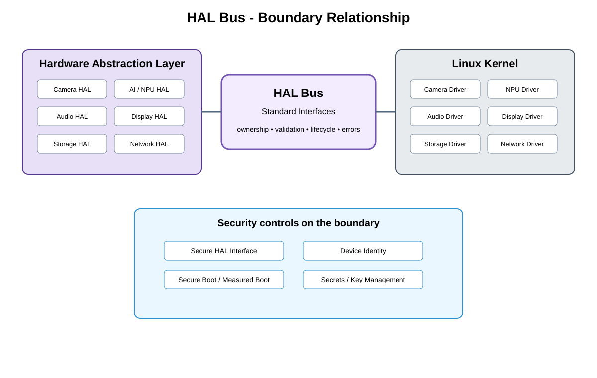

# Platform HAL / OS Integration Boundary Detailed Design — Platform Baseline v2

## Status
Revised against PR #77.

## Deployment placement
**Camera platform integration; selected OS implementation such as Linux**

## Purpose and ownership
Re-scope the former HAL Bus as platform-specific HAL-to-operating-system integration beneath portable hardware contracts, not a separately deployed generic bus.

## Boundary contract
PlatformIntegration boundary defining capability/version compatibility, ownership, error translation, reset/power behavior, and driver-adapter responsibility.

## Relationship overview

## Review-driven decisions
- Linux is one implementation, not the product contract.
- Portable hardware contracts stay above this boundary.
- Overlap with driver adapters is explicit.
- Error translation ownership is assigned.
- Capability/version and reset/power behavior are defined.
- No generic HAL bus process/service is required unless justified by a product.

## Product Profile inputs
- selected OS/board/protocol/provider;
- compatible versions/capabilities;
- reset/power/error ownership;
- security and qualification constraints.

## Boundary rule
Implementation and physical boundaries expose stable guarantees upward but are not modeled as mandatory product services unless a concrete deployment requires one.

## Open decisions
- concrete OS/board/protocol selections;
- numerical electrical/timing/reset limits.

## Design acceptance criteria
1. A non-Linux platform can implement the same portable hardware contracts.
2. No separately deployed HAL bus is required by default.
3. Driver/HAL error translation has one owner.
4. Incompatible capability/version fails before operation.

## Changelog
- 2026-10-04: Re-scoped from generic bus model to Platform Architecture Baseline v2 boundary/qualification model.
