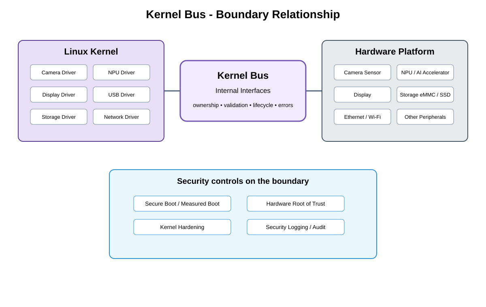

# Driver / Device Integration Boundary Detailed Design — Platform Baseline v2

## Status
Revised against PR #77.

## Deployment placement
**Operating-System / Vendor Integration on Camera**

## Purpose and ownership
Clarify driver/device integration as an implementation boundary distinct from physical interconnects and not as another mandatory product service.

## Boundary contract
DriverDeviceIntegration boundary defining register/device ownership, reset/error handling, power/lifecycle coordination, and stable guarantees exposed upward.

## Relationship overview

## Review-driven decisions
- Physical protocols belong to Hardware Bus qualification.
- Driver/device integration owns raw register/bus access.
- Reset/error handling stays within platform integration.
- Linux-specific interfaces remain below common contracts.
- No generic kernel bus service is introduced.

## Product Profile inputs
- selected OS/board/protocol/provider;
- compatible versions/capabilities;
- reset/power/error ownership;
- security and qualification constraints.

## Boundary rule
Implementation and physical boundaries expose stable guarantees upward but are not modeled as mandatory product services unless a concrete deployment requires one.

## Open decisions
- concrete OS/board/protocol selections;
- numerical electrical/timing/reset limits.

## Design acceptance criteria
1. Upper product services never depend on raw registers or kernel APIs.
2. Physical bus protocol changes remain below this boundary.
3. Reset/error mapping is deterministic.
4. A different OS can preserve the same portable upper guarantees.

## Changelog
- 2026-10-04: Re-scoped from generic bus model to Platform Architecture Baseline v2 boundary/qualification model.
