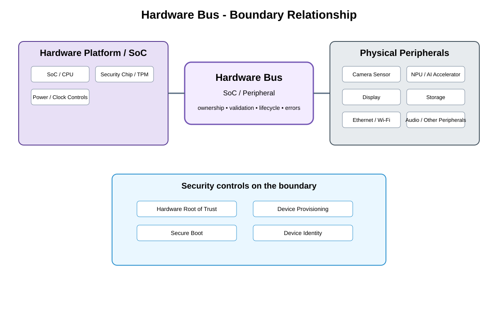

# Hardware Bus Detailed Design

## Component
`hardware_bus`

## Purpose
Defines the approved **SoC / Peripheral** communication boundary between **Hardware Platform / SoC** and **Physical Peripherals**.

## Relationship overview

## Upper-side participants
- SoC / CPU
- Security Chip / TPM
- Power / Clock Controls

## Lower-side participants
- Camera Sensor
- NPU / AI Accelerator
- Display
- Storage
- Ethernet / Wi-Fi
- Audio / Other Peripherals

## Boundary responsibilities
- Define stable operations and ownership rules appropriate to SoC / Peripheral.
- Validate capabilities, parameters, lifecycle state, and resource ownership.
- Return stable status/errors without leaking uncontrolled implementation details upward.
- Prevent direct bypass of the owning kernel, HAL, or hardware boundary.

## Security controls
- Hardware Root of Trust
- Device Provisioning
- Secure Boot
- Device Identity

## Failure behavior
- peripheral bus fault
- device not responding
- power or reset sequencing failure

## Open design items
- exact interface/protocol versioning and compatibility rules
- timeout, reset, and recovery behavior
- observability and fault-correlation identifiers
- power/lifecycle interaction across the boundary

## Changelog
- 2026-10-04: Added detailed communication-boundary design and relationship diagram.
