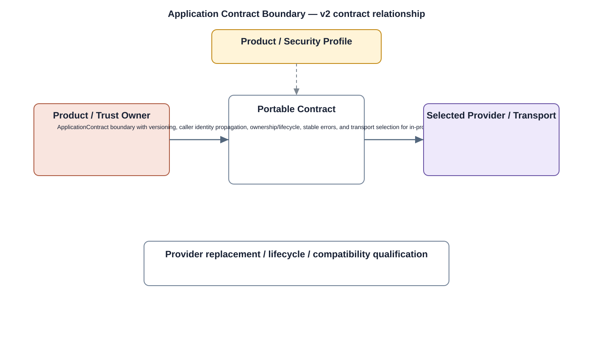

# Application Contract Boundary Detailed Design — Platform Baseline v2

## Status
Revised against PR #77.

## Deployment placement
**Across Client/Camera/Gateway/Backend as required; transport selected per deployment**

## Purpose and ownership
Re-scope the former Application Bus from mandatory IPC/Binder into transport-independent application/service contracts.

## Portable contract
ApplicationContract boundary with versioning, caller identity propagation, ownership/lifecycle, stable errors, and transport selection for in-process, local IPC, or remote communication.

## Relationship overview

## Review-driven decisions
- Binder is an Android-specific adapter, not the product contract.
- In-process, local IPC, and remote network calls are distinct transport selections.
- Identity/authorization context propagation is explicit.
- Ownership and error semantics are transport-independent.
- Product Profile selects deployment transport.

## Product / Security Profile inputs
- required capability/transport and placement;
- compatible contract/provider versions;
- trust, offline, and failure policy;
- qualification evidence where applicable.

## Design rule
Portable product semantics are defined independently of specific transports, operating systems, hardware providers, or manufacturing mechanisms.

## Open decisions
- concrete transport/provider mechanisms;
- profile-specific TTL, version, and qualification limits.

## Design acceptance criteria
1. The same application contract can run in-process, over local IPC, or remotely where allowed.
2. Remote client does not require Binder.
3. Transport replacement does not change service semantics.
4. Incompatible contract versions fail explicitly.

## Changelog
- 2026-10-04: Reworked for Platform Architecture Baseline v2 and review feedback.
