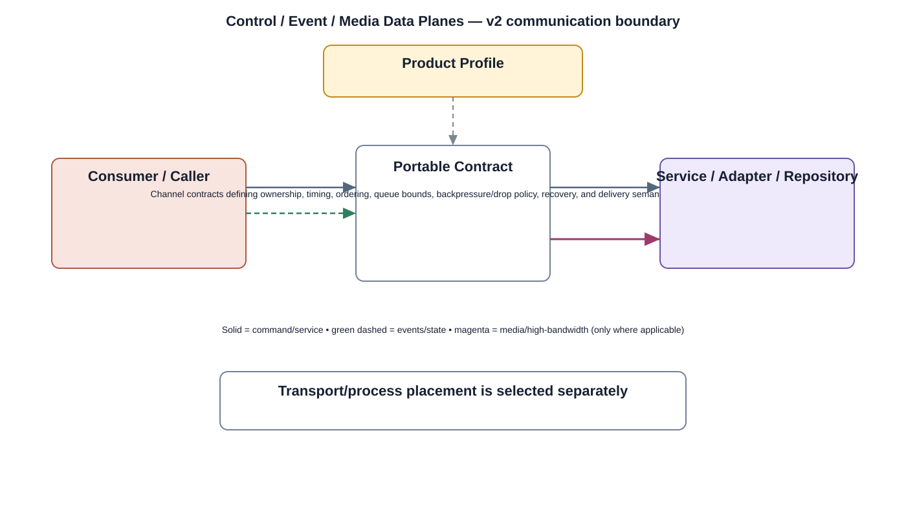

# Control / Event / Media Data Planes Detailed Design — Platform Baseline v2

## Status
Revised against PR #77.

## Deployment placement
**Across Camera services/middleware and optional Gateway/Backend paths**

## Purpose and ownership
Replace the generic Data Bus concept with separate control commands, state/events, durable events, and media/high-bandwidth paths.

## Portable boundary
Channel contracts defining ownership, timing, ordering, queue bounds, backpressure/drop policy, recovery, and delivery semantics for each data plane.

## Relationship overview

## Review-driven decisions
- Control commands are not media payloads.
- Durable events differ from transient state events.
- Media buffers/streams have explicit high-bandwidth ownership/timing.
- Queues are bounded.
- Backpressure/drop policy is explicit.
- Large video payloads are not forced through a generic message bus.

## Product Profile inputs
- deployment/process placement;
- transport/channel/provider selection;
- compatible contract versions;
- queue/timeout/performance/security policy.

## Communication rule
Transport/process choice is independent of product semantics. Different delivery classes are not forced through one generic bus.

## Open decisions
- exact local/remote transport selections;
- numerical queue, timeout, backpressure, and compatibility limits.

## Design acceptance criteria
1. Media overload follows defined buffer/drop/backpressure policy.
2. Durable event loss/retry semantics are explicit.
3. Control commands cannot be starved by an unbounded video queue.
4. Channel ordering guarantees are documented per data plane.

## Changelog
- 2026-10-04: Re-scoped from generic bus to explicit contract/data-plane model for Platform Architecture Baseline v2.
