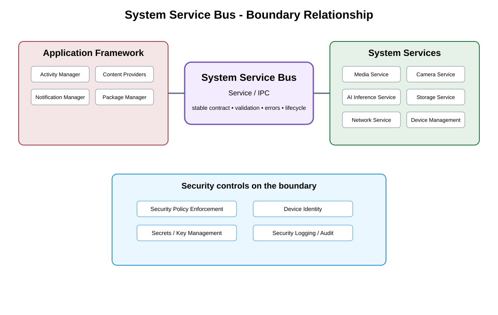

# Service Contract Boundary Detailed Design — Platform Baseline v2

## Status
Revised against PR #77.

## Deployment placement
**In-process, local process, or remote deployment according to each service contract**

## Purpose and ownership
Re-scope the former System Service Bus into explicit service contracts independent of a mandatory application-framework hop or universal bus.

## Portable boundary
ServiceContract boundary with call style, discovery/binding, ownership, compatibility, authorization context, timeout, unavailable-service behavior, and selected transport.

## Relationship overview

## Review-driven decisions
- Service interactions may be direct function calls, local IPC, or network calls.
- Application Framework is not a mandatory hop.
- Discovery/binding semantics are explicit where needed.
- Compatibility and ownership are defined per service.
- Authorization context and unavailable-service behavior are explicit.

## Product Profile inputs
- deployment/process placement;
- transport/channel/provider selection;
- compatible contract versions;
- queue/timeout/performance/security policy.

## Communication rule
Transport/process choice is independent of product semantics. Different delivery classes are not forced through one generic bus.

## Open decisions
- exact local/remote transport selections;
- numerical queue, timeout, backpressure, and compatibility limits.

## Design acceptance criteria
1. A service can move process/deployment without changing portable service semantics.
2. No universal bus implementation is required.
3. Unavailable service returns defined status/timeouts.
4. Transport changes preserve authorization and compatibility semantics.

## Changelog
- 2026-10-04: Re-scoped from generic bus to explicit contract/data-plane model for Platform Architecture Baseline v2.
