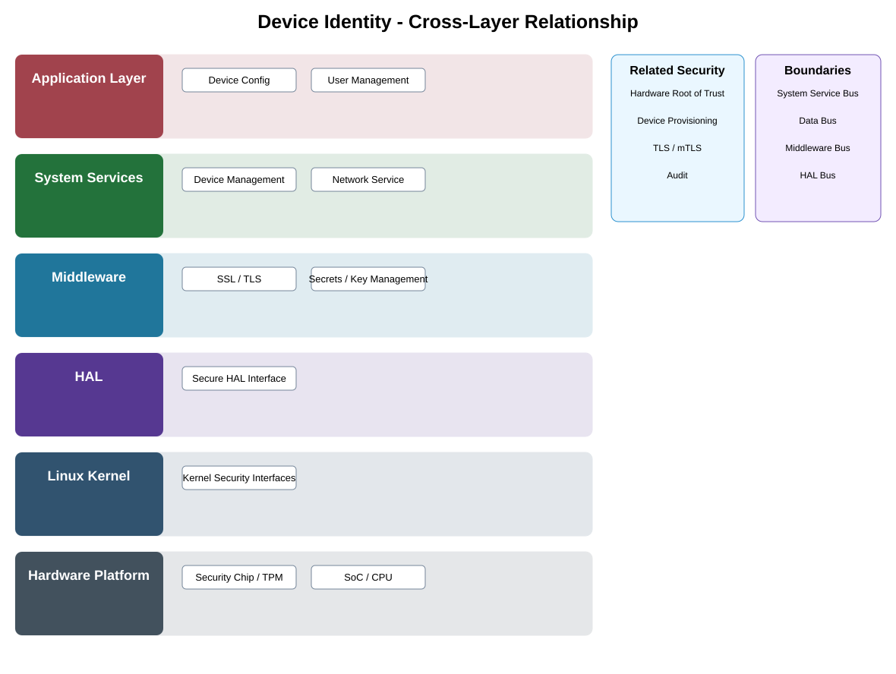

# Device Identity Detailed Design

## Component
`device_identity`

## Purpose
Provides a unique cryptographic device identity rooted in protected certificates and keys for authentication, provisioning, and trusted communication.

## Relationship overview

## Cross-layer relationship

### Application Layer
- Device Config
- User Management
### System Services
- Device Management
- Network Service
### Middleware
- SSL / TLS
- Secrets / Key Management
### HAL
- Secure HAL Interface
### Linux Kernel
- Kernel Security Interfaces
### Hardware Platform
- Security Chip / TPM
- SoC / CPU

## Related security services
- Hardware Root of Trust
- Device Provisioning
- TLS / mTLS
- Audit

## Communication / enforcement boundaries
- System Service Bus
- Data Bus
- Middleware Bus
- HAL Bus

## Design rules
- Security behavior shall be centralized through this approved service/control rather than reimplemented independently.
- Consumers shall use stable interfaces and avoid direct access to protected implementation or key material.
- Policy, identity, key, and audit dependencies shall fail safely.

## Failure behavior
- certificate invalid
- protected key unavailable
- identity provisioning incomplete

## Changelog
- 2026-10-04: Added detailed cross-layer relationship design.
