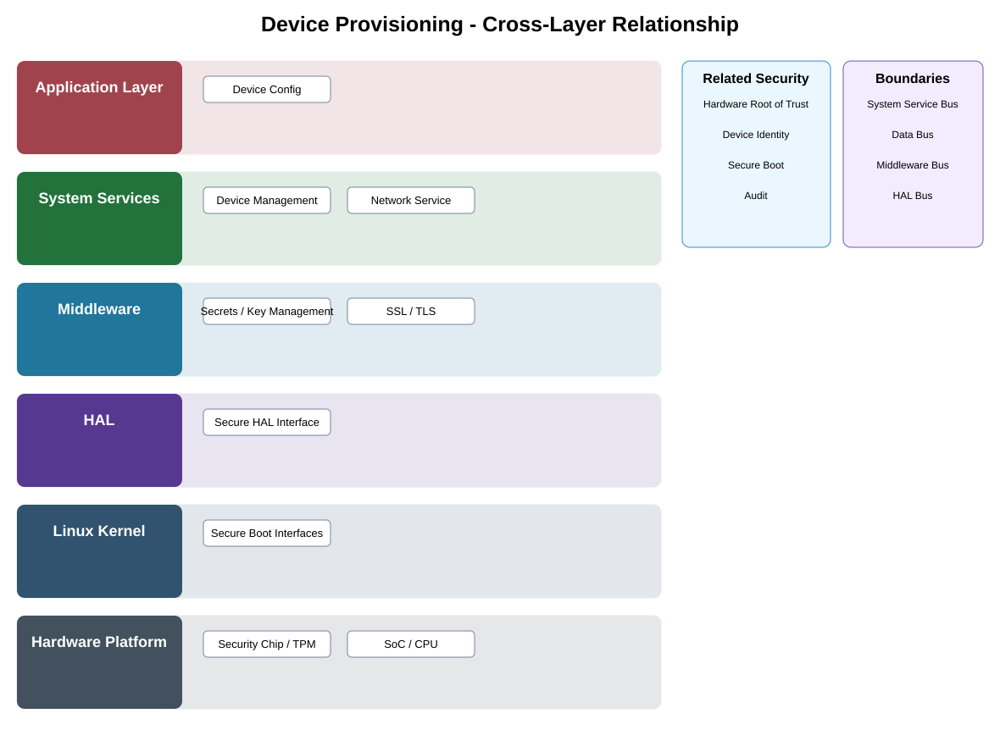

# Device Provisioning Detailed Design

## Component
`device_provisioning`

## Purpose
Establishes initial device identity, credentials, trust relationships, and approved configuration during manufacturing or enrollment.

## Relationship overview

## Cross-layer relationship

### Application Layer
- Device Config
### System Services
- Device Management
- Network Service
### Middleware
- Secrets / Key Management
- SSL / TLS
### HAL
- Secure HAL Interface
### Linux Kernel
- Secure Boot Interfaces
### Hardware Platform
- Security Chip / TPM
- SoC / CPU

## Related security services
- Hardware Root of Trust
- Device Identity
- Secure Boot
- Audit

## Communication / enforcement boundaries
- System Service Bus
- Data Bus
- Middleware Bus
- HAL Bus

## Design rules
- Security controls shall be enforced at the owning trust or kernel boundary.
- Protected trust state and credentials shall not be exposed directly to applications.
- Security failures shall fail safely and remain auditable.

## Failure behavior
- credential injection failure
- trust anchor unavailable
- provisioning state conflict

## Changelog
- 2026-10-04: Added detailed cross-layer relationship design.
