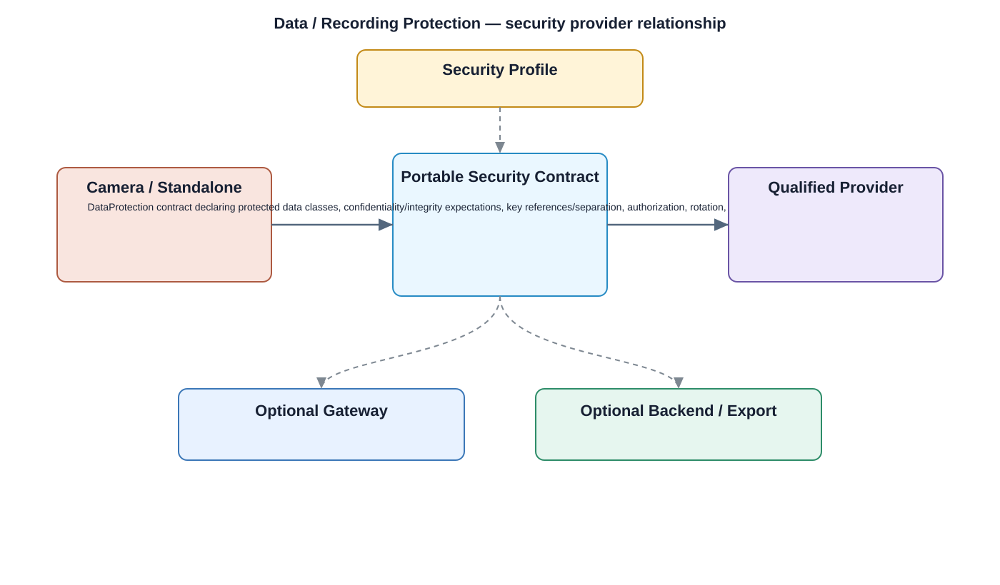

# Data / Recording Protection Detailed Design — Platform Baseline v2

## Status
Revised against PR #77.

## Deployment placement
**Camera mandatory where protected local data exists; Gateway/Backend equivalents selected by Security Profile**

## Purpose and ownership
Define recording/data protection outcomes separately from transport security and from the selected cryptographic provider.

## Security contract
DataProtection contract declaring protected data classes, confidentiality/integrity expectations, key references/separation, authorization, rotation, retention/deletion, and recovery behavior.

## Relationship overview

## Review-driven decisions
- Recording/data protection is not a generic encrypt/decrypt API.
- Protected data classes are explicit.
- Integrity expectations are explicit.
- Key purpose/separation and authorization are defined.
- Rotation and retention/deletion behavior are explicit.
- Recovery behavior is defined independently of cryptographic provider.

## Security Profile inputs
- required protection/audit/key outcomes;
- placement/provider selection;
- lifecycle/rotation/retention/recovery policy;
- offline/buffering behavior;
- compatible contract/provider versions.

## Provider separation
Product protection requirements remain stable while cryptographic, key-store, hardware, and audit providers are replaceable through qualified adapters.

## Open decisions
- concrete cryptographic/key/audit providers;
- numerical retention, buffer, rotation, and recovery limits.

## Design acceptance criteria
1. Changing cryptographic provider does not change which data must be protected.
2. Recording deletion handles associated key/reference lifecycle according to policy.
3. Transport-security provider changes do not alter at-rest protection requirements.
4. Recovery does not require exposing raw protected keys to application components.

## Changelog
- 2026-10-04: Reworked for Platform Architecture Baseline v2 and security-review feedback.
