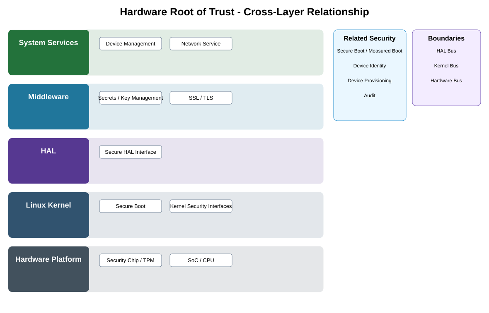

# Hardware Root of Trust Detailed Design — Platform Baseline v2

## Status
Revised against PR #77.

## Deployment placement
**Camera security-provider capability selected by Security Profile**

## Purpose and ownership
Treat hardware root of trust as a capability/provider contract with explicit assurance expectations, not an assumption that every provider supplies every function.

## Portable contract
RootOfTrustProvider contract covering boot anchors, protected key operations, optional measurements, optional attestation, provisioning, failure, replacement, and qualification evidence.

## Relationship overview

## Review-driven decisions
- Boot trust anchor, key protection, measurement, and attestation are separate capabilities.
- Security Profile selects required subset.
- Provider may qualify without optional functions.
- Provisioning and replacement lifecycle are explicit.
- Qualification evidence is required.

## Product / Security Profile inputs
- required capability/transport and placement;
- compatible contract/provider versions;
- trust, offline, and failure policy;
- qualification evidence where applicable.

## Design rule
Portable product semantics are defined independently of specific transports, operating systems, hardware providers, or manufacturing mechanisms.

## Open decisions
- concrete transport/provider mechanisms;
- profile-specific TTL, version, and qualification limits.

## Design acceptance criteria
1. Provider lacking attestation can qualify for a profile that does not require attestation.
2. Required protected-key/boot-anchor guarantees are verified.
3. Provider replacement does not alter upper security-service contracts.
4. Provider failure produces explicit safe degradation/failure.

## Changelog
- 2026-10-04: Reworked for Platform Architecture Baseline v2 and review feedback.
