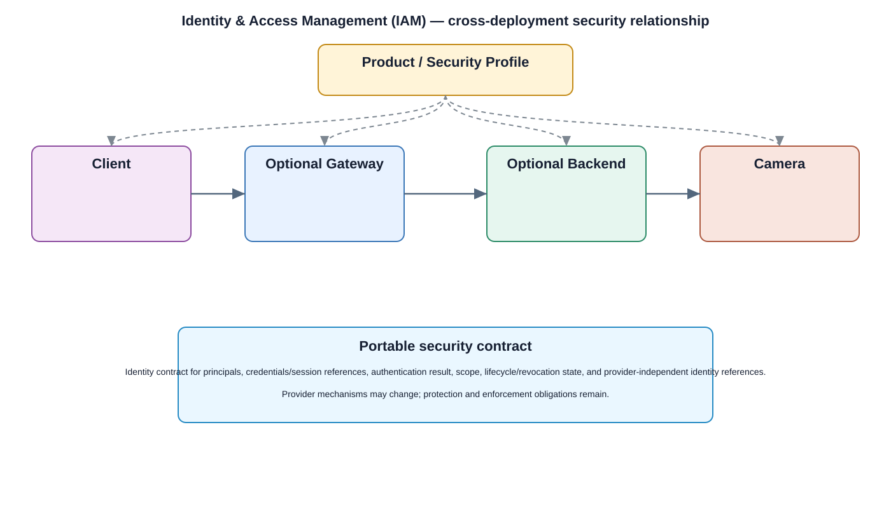

# IAM — Identity & Access Management Detailed Design

## Component
`iam`

## Purpose
Centralizes identity lifecycle, authentication context, and access-management decisions for users, devices, services, and administrators.

## Relationship overview

## Cross-layer relationship

### Application Layer
- User Management
- Live View
- Playback
- Settings
### Application Framework
- Security Policy Enforcement
### System Services
- Device Management
- Network Service
### Middleware
- Database
- SSL / TLS
### Hardware Platform
- Security Chip / TPM
- SoC / CPU

## Related security services
- RBAC
- Device Identity
- Secrets / Key Management
- Audit

## Communication / enforcement boundaries
- Application Bus
- System Service Bus
- Data Bus

## Design rules
- Security behavior shall be centralized through this approved service/control rather than reimplemented independently.
- Consumers shall use stable interfaces and avoid direct access to protected implementation or key material.
- Policy, identity, key, and audit dependencies shall fail safely.

## Failure behavior
- identity store unavailable
- authentication failure
- identity state conflict

## Changelog
- 2026-10-04: Added detailed cross-layer relationship design.
