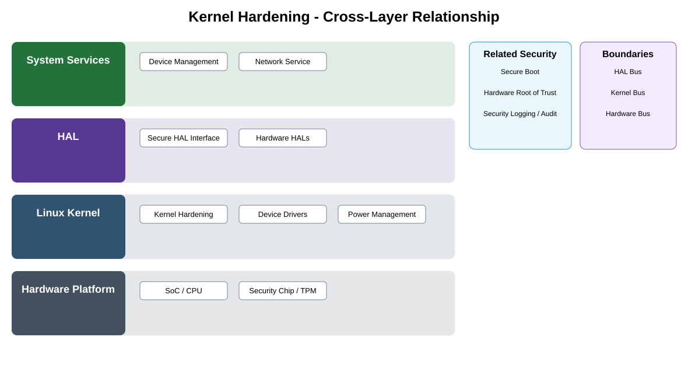

# Kernel Hardening Detailed Design

## Component
`kernel_hardening`

## Purpose
Reduces kernel attack surface and enforces kernel-level security controls for drivers, memory, privileges, device access, and runtime behavior.

## Relationship overview

## Cross-layer relationship

### System Services
- Device Management
- Network Service
### HAL
- Secure HAL Interface
- Hardware HALs
### Linux Kernel
- Kernel Hardening
- Device Drivers
- Power Management
### Hardware Platform
- SoC / CPU
- Security Chip / TPM

## Related security services
- Secure Boot
- Hardware Root of Trust
- Security Logging / Audit

## Communication / enforcement boundaries
- HAL Bus
- Kernel Bus
- Hardware Bus

## Design rules
- Security controls shall be enforced at the owning trust or kernel boundary.
- Protected trust state and credentials shall not be exposed directly to applications.
- Security failures shall fail safely and remain auditable.

## Failure behavior
- required hardening control unavailable
- policy/configuration mismatch
- security violation detected

## Changelog
- 2026-10-04: Added detailed cross-layer relationship design.
