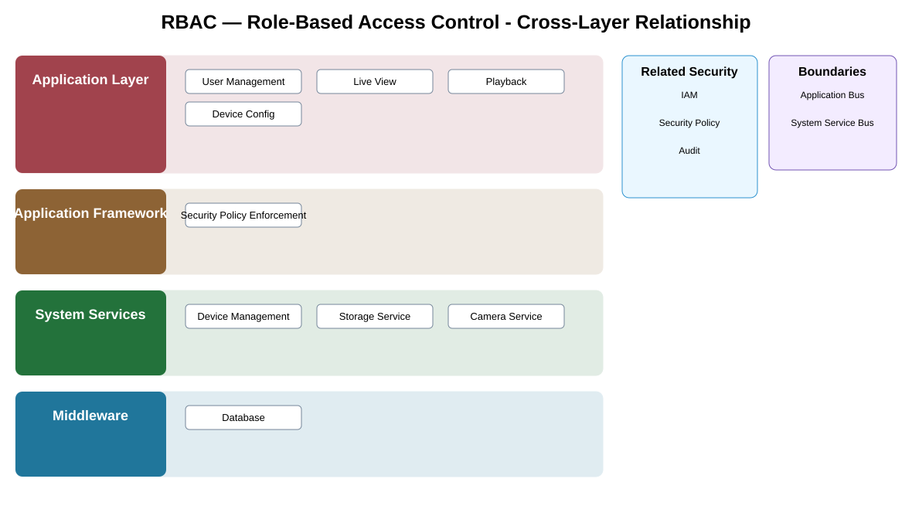

# RBAC — Role-Based Access Control Detailed Design

## Component
`rbac`

## Purpose
Maps approved roles to permissions so access decisions are consistent, reviewable, and not implemented ad hoc by individual applications.

## Relationship overview

## Cross-layer relationship

### Application Layer
- User Management
- Live View
- Playback
- Device Config
### Application Framework
- Security Policy Enforcement
### System Services
- Device Management
- Storage Service
- Camera Service
### Middleware
- Database

## Related security services
- IAM
- Security Policy
- Audit

## Communication / enforcement boundaries
- Application Bus
- System Service Bus

## Design rules
- Security behavior shall be centralized through this approved service/control rather than reimplemented independently.
- Consumers shall use stable interfaces and avoid direct access to protected implementation or key material.
- Policy, identity, key, and audit dependencies shall fail safely.

## Failure behavior
- role data unavailable
- unknown role
- policy conflict

## Changelog
- 2026-10-04: Added detailed cross-layer relationship design.
