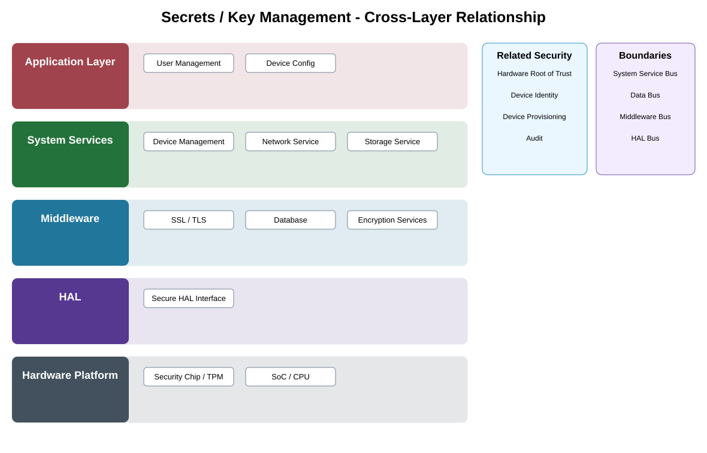

# Secrets / Key Management Detailed Design — Platform Baseline v2

## Status
Revised against PR #77.

## Deployment placement
**Camera mandatory for local protected keys; Gateway/Backend equivalents as selected**

## Purpose and ownership
Separate key purposes and owners for device identity, firmware/update signing verification, transport, recording/data protection, and other product secrets.

## Security contract
KeyManagement contract with purpose-bound key references, provisioning, non-exportability policy, renewal/rotation, revocation, backup/recovery, hardware-failure handling, and retirement.

## Relationship overview

## Review-driven decisions
- Key purpose separation is mandatory.
- Owners/lifecycles differ by key purpose.
- Non-exportability is declared where required.
- Backup/recovery is purpose/profile-specific.
- Hardware provider failure has defined recovery/degradation.
- Provider replacement preserves protection obligations.

## Security Profile inputs
- required protection/audit/key outcomes;
- placement/provider selection;
- lifecycle/rotation/retention/recovery policy;
- offline/buffering behavior;
- compatible contract/provider versions.

## Provider separation
Product protection requirements remain stable while cryptographic, key-store, hardware, and audit providers are replaceable through qualified adapters.

## Open decisions
- concrete cryptographic/key/audit providers;
- numerical retention, buffer, rotation, and recovery limits.

## Design acceptance criteria
1. Recording key cannot be substituted for device identity key purpose.
2. Non-exportable key never appears in application memory when profile forbids export.
3. Revoked key cannot be used after defined enforcement boundary.
4. Hardware replacement/recovery follows documented ownership and recovery policy.

## Changelog
- 2026-10-04: Reworked for Platform Architecture Baseline v2 and security-review feedback.
