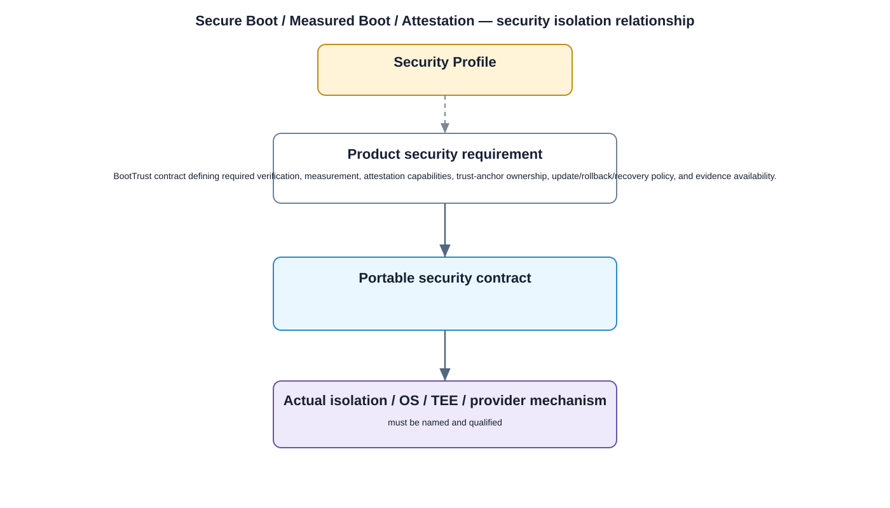

# Secure Boot / Measured Boot / Attestation Detailed Design — Platform Baseline v2

## Status
Revised against PR #77.

## Deployment placement
**Camera platform security; capabilities selected by Security Profile**

## Purpose and ownership
Separate secure-boot verification, measured-boot evidence, and remote attestation because they provide different assurances.

## Security contract
BootTrust contract defining required verification, measurement, attestation capabilities, trust-anchor ownership, update/rollback/recovery policy, and evidence availability.

## Relationship overview

## Review-driven decisions
- Secure boot verification is distinct from measurement collection.
- Remote attestation is optional unless profile requires it.
- Security Profile declares required capabilities.
- Trust-anchor ownership is explicit.
- Authenticated update and approved rollback/recovery are defined.
- Unavailable measurements/attestation have explicit behavior.

## Security Profile inputs
- required protection/isolation/evidence capabilities;
- selected OS/provider mechanism;
- compatible versions and qualification evidence;
- fallback/recovery/release behavior.

## Trust boundary rule
The design names the real isolation mechanism. A software API alone is not treated as a security boundary unless backed by process/OS/TEE/hardware enforcement.

## Open decisions
- selected platform/provider mechanisms;
- profile-specific evidence and release thresholds.

## Design acceptance criteria
1. A profile requiring only secure boot can use a provider without remote attestation.
2. Unauthorized firmware fails verification before activation.
3. Rollback/recovery follows approved signed policy.
4. Missing measurement evidence is surfaced rather than fabricated.

## Changelog
- 2026-10-04: Reworked for Platform Architecture Baseline v2 and security-boundary review feedback.
