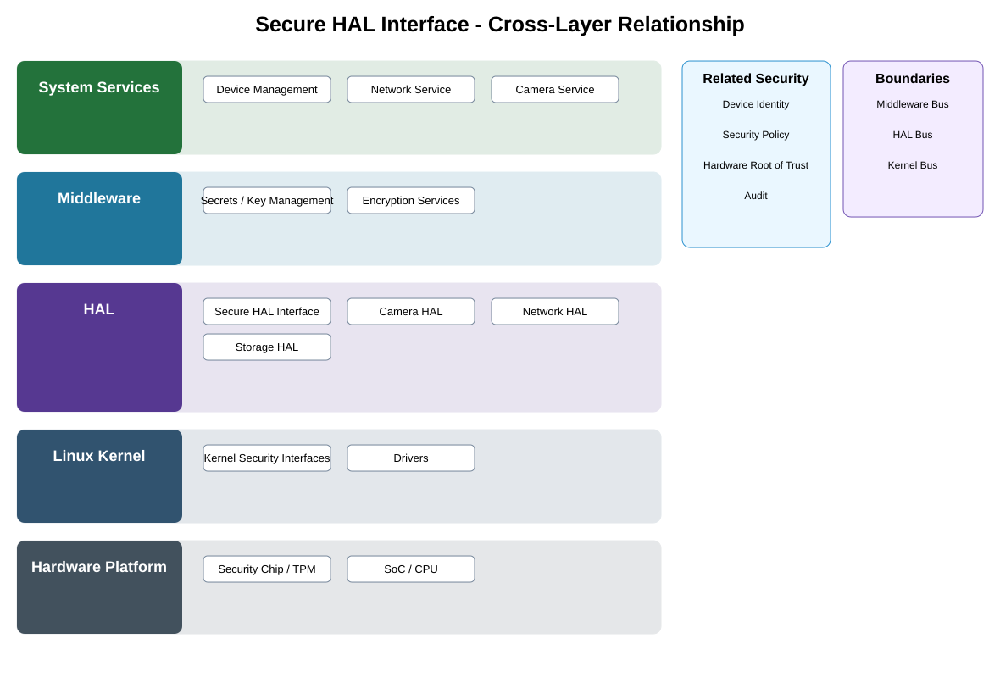

# Secure HAL Interface Detailed Design

## Component
`secure_hal_interface`

## Purpose
Defines authenticated, authorized, and validated access to security-sensitive hardware abstraction interfaces and protected hardware operations.

## Relationship overview

## Cross-layer relationship

### System Services
- Device Management
- Network Service
- Camera Service
### Middleware
- Secrets / Key Management
- Encryption Services
### HAL
- Secure HAL Interface
- Camera HAL
- Network HAL
- Storage HAL
### Linux Kernel
- Kernel Security Interfaces
- Drivers
### Hardware Platform
- Security Chip / TPM
- SoC / CPU

## Related security services
- Device Identity
- Security Policy
- Hardware Root of Trust
- Audit

## Communication / enforcement boundaries
- Middleware Bus
- HAL Bus
- Kernel Bus

## Design rules
- Consumers shall use approved security interfaces rather than implement private alternatives.
- Protected keys, measurements, or trust state shall remain behind the owning secure boundary.
- Security failures shall fail safely and preserve auditability.

## Failure behavior
- caller authentication failure
- authorization denial
- protected hardware unavailable

## Changelog
- 2026-10-04: Added detailed cross-layer relationship design.
