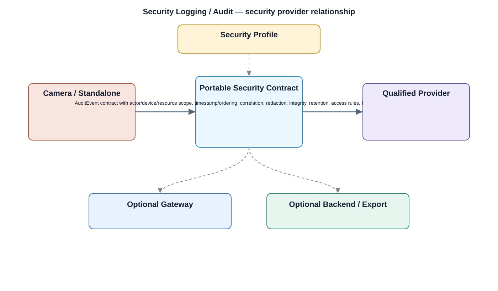

# Security Logging / Audit Detailed Design

## Component
`security_logging_audit`

## Purpose
Collects security-relevant events and maintains an auditable trail across applications, services, middleware, kernel, and device lifecycle operations.

## Relationship overview

## Cross-layer relationship

### Application Layer
- Live View
- Playback
- User Management
- Settings
### Application Framework
- Security Policy Enforcement
- Package Manager
### System Services
- Device Management
- Network Service
- Storage Service
### Middleware
- Database
- SSL / TLS
### Linux Kernel
- Kernel Security Events
### Hardware Platform
- Security Chip / TPM
- SoC / CPU

## Related security services
- IAM
- RBAC
- Device Identity
- Encryption

## Communication / enforcement boundaries
- Application Bus
- System Service Bus
- Data Bus
- Kernel Bus

## Design rules
- Consumers shall use approved security interfaces rather than implement private alternatives.
- Protected keys, measurements, or trust state shall remain behind the owning secure boundary.
- Security failures shall fail safely and preserve auditability.

## Failure behavior
- log storage unavailable
- event queue overflow
- clock or ordering anomaly

## Changelog
- 2026-10-04: Added detailed cross-layer relationship design.
