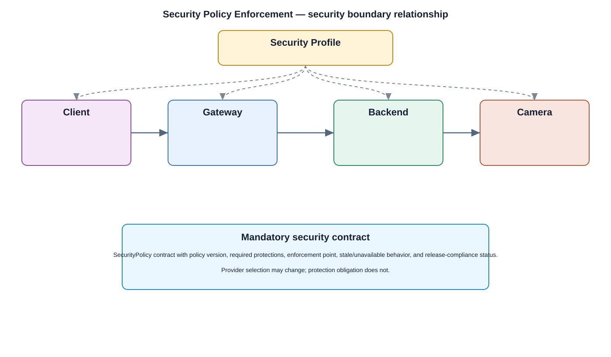

# Security Policy Enforcement Detailed Design

## Component
`security_policy_enforcement`

## Purpose
Applies centrally defined security policy at approved enforcement points so components do not invent conflicting local security behavior.

## Relationship overview

## Cross-layer relationship

### Application Layer
- Live View
- Playback
- Settings
- User Management
### Application Framework
- Security Policy Enforcement
- Package Manager
### System Services
- Device Management
- Network Service
- Storage Service
### Middleware
- Database
- SSL / TLS
### HAL
- Secure HAL Interface
### Linux Kernel
- Kernel Hardening

## Related security services
- IAM
- RBAC
- Device Identity
- Audit

## Communication / enforcement boundaries
- Application Bus
- System Service Bus
- Data Bus
- Middleware Bus

## Design rules
- Security behavior shall be centralized through this approved service/control rather than reimplemented independently.
- Consumers shall use stable interfaces and avoid direct access to protected implementation or key material.
- Policy, identity, key, and audit dependencies shall fail safely.

## Failure behavior
- policy unavailable
- conflicting policy
- enforcement point failure

## Changelog
- 2026-10-04: Added detailed cross-layer relationship design.
