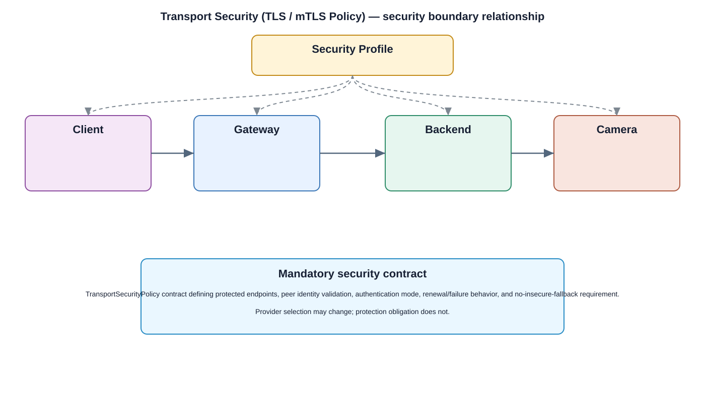

# TLS / mTLS — Transport Security Detailed Design

## Component
`tls_mtls`

## Purpose
Provides encrypted and authenticated transport for approved remote and inter-service communication, including mutual authentication where required.

## Relationship overview

## Cross-layer relationship

### Application Layer
- Live View
- Playback
- Mobile / Web UI
- User Management
### System Services
- Network Service
- Device Management
### Middleware
- SSL / TLS
- Secrets / Key Management
### HAL
- Network HAL
### Linux Kernel
- Network Driver
### Hardware Platform
- Ethernet / Wi-Fi
- Security Chip / TPM

## Related security services
- Device Identity
- Secrets / Key Management
- Audit

## Communication / enforcement boundaries
- Data Bus
- Middleware Bus
- HAL Bus

## Design rules
- Security behavior shall be centralized through this approved service/control rather than reimplemented independently.
- Consumers shall use stable interfaces and avoid direct access to protected implementation or key material.
- Policy, identity, key, and audit dependencies shall fail safely.

## Failure behavior
- certificate validation failure
- handshake timeout
- key unavailable

## Changelog
- 2026-10-04: Added detailed cross-layer relationship design.
